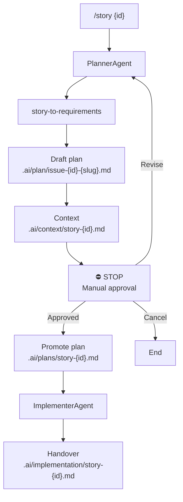

# Story

Single entry point for the Fabric story SDLC:

**Plan → Manual Approval → Implement**

```
/story 42
```

Delegates to **planner-agent** (which uses **story-to-requirements**) and **implementer**.

---

## Workflow



---

## Phase 1: Plan (PlannerAgent)

Follow **planner-agent** (`.cursor/agents/planner-agent.md`), which delegates requirement authoring to **story-to-requirements**.

**Then STOP.** Do not implement in the same turn.

---

## Approval gate (manual — human only)

Handled by **planner-agent** Steps 4–5. The agent must:

- Present the approval summary and **STOP**
- **Wait for human reply** — never self-approve

### If `Revise: ...`

Re-run **planner-agent** / **story-to-requirements** (planner-agent § On revision request).

### If `Cancel`

Acknowledge and end.

### If `Approved`

Proceed to promotion, then Phase 2.

---

## Promotion (on Approved)

Follow **planner-agent** § On human approval:

1. Copy draft → `.ai/plans/story-{id}.md`
2. Set `**Status:** Approved` with approval metadata
3. Warn if 🔴 blocking open questions remain (human overrode by approving)

---

## Phase 2: Implement (ImplementerAgent)

Triggered when the human replies **`Approved`** after Phase 1.

**Prerequisites:**

- Approved plan at `.ai/plans/story-{id}.md` with `**Status:** Approved`
- If missing: **STOP** — run `/story {id}` first

Follow **implementer** (`.cursor/skills/implementer/SKILL.md`):

1. Context validation
2. Impact analysis
3. Implementation (plan steps only)
4. Testing (lint, build, unit tests)
5. Self-review
6. Handover → `.ai/implementation/story-{id}.md`

**Rules:** No commits, no PRs, no scope outside plan, no AC/architecture changes.

---

## Usage

```text
/story 42
```

After planning, review the draft plan and reply:

```text
Approved
```

---

## Outputs

| Phase | File |
|-------|------|
| Plan | `.ai/plan/issue-{id}-{slug}.md` |
| Context | `.ai/context/story-{id}.md` |
| Approved plan | `.ai/plans/story-{id}.md` |
| Implementation | `.ai/implementation/story-{id}.md` |

## Final chat summary (after Phase 2)

1. Draft plan path
2. Approved plan path
3. Implementation handover path
4. Status: Ready for review | Blocked
5. Test results and AC coverage
6. Reviewer focus areas
